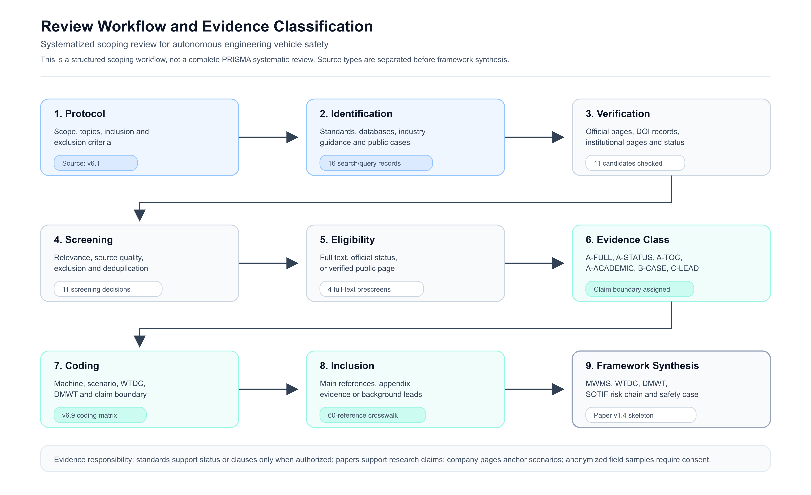

# From Safe Driving to Safe Working: A Safety Assurance Framework for Autonomous Engineering Vehicles

## Draft Metadata and Verification Notes

Authors: Zhang Yuxin; Li Xuefei; Yao Zongwei

Author order, affiliations and corresponding author details will be finalized before formal submission.

Corresponding author email: [to be confirmed]

Corresponding author postal address: [to be confirmed]

ORCID: [to be confirmed]

Author contribution statement: [to be confirmed]

Funding statement: [to be confirmed]

Competing interest statement: [to be confirmed]

AI-assisted writing statement: [to be confirmed]

Internal engineering background inputs to be verified before public citation:

1. Li Xuefei's autonomous construction-machinery materials frame autonomous wheel-loader operation as an engineering problem driven by mine, construction-site and port intelligence needs. The materials emphasize that loaders are work-oriented machines, not only driving platforms.
2. The business-plan material identifies autonomous digging, autonomous unloading, material-pile perception, bucket fill-rate measurement, path planning, tracking control and repeated work-cycle execution as core technical problems. These points support the MWMS, WTDC and DMWT framing in this draft, but the internal slides are not independent public evidence.
3. The 20240514 Move the Earth and Beyond slides connect terrestrial construction/mining automation with lunar and Mars resource utilization, future exploration test-site design, Built Robotics safety mechanisms and NASA/DLR space-resource references. These ideas are used as project-background framing and still require source-by-source verification before being cited as external evidence.

## Abstract

Road-vehicle automation safety has developed mature methods for functional safety, Safety of the Intended Functionality, cybersecurity, AI safety, scenario-based testing and safety cases. Autonomous engineering vehicles are moving into batching plants, mines, construction sites, solar farms and other controlled worksites, but their safety assurance evidence remains fragmented across machinery safety, functional safety of control systems, autonomous mining guidance, collision warning standards, adjacent non-road machinery standards, company cases and project-specific operational rules. This paper develops a safety assurance framework for autonomous engineering vehicles as mobile working machine systems. We review road-vehicle safety methods as methodological donors, map existing earth-moving and mining-machine standards, and identify where direct transfer is misleading. We then introduce three concepts: mobile working machine system, worksite and task design conditions, and dynamic moving and working task. The framework links system boundaries, worksite and task conditions, function insufficiencies, trigger conditions, task consequences, testing, operational monitoring and safety cases. Representative wheel-loader, trenching, solar piling and autonomous haulage scenarios are used as structured templates rather than evidence of product maturity. The paper concludes by discussing how the framework extends to lunar and other extreme-environment mobile work.

## Highlights

- Road-vehicle safety methods structure mobile-machine assurance.
- MWMS, WTDC and DMWT extend ODD and DDT to worksite tasks.
- Safety cases must cover tools, materials and remote supervision.
- Public cases anchor scenarios but do not prove field maturity.
- Space mining frames extreme mobile working-machine safety.

## Keywords

Autonomous engineering vehicles; mobile working machines; SOTIF; functional safety; safety case; scenario-based testing; autonomous mining.

## 1. Introduction

### 1.1 From automated driving to autonomous engineering work

Road-vehicle automation has created a relatively mature safety engineering landscape. Passive safety and active safety provide long-standing vehicle safety foundations. Functional safety addresses hazards caused by malfunctioning behaviour of electrical and electronic systems. Safety of the Intended Functionality addresses unreasonable risk that may arise even when a system is free from faults but insufficient for its intended function or operating conditions. Cybersecurity engineering addresses malicious or unintended interference with connected and software-intensive vehicle systems. More recently, AI safety, scenario-based testing and safety cases have become central to how automated driving systems are argued to be safe in bounded conditions [1, 2, 3, 4, 5, 6].

Autonomous engineering vehicles are entering a similar but more heterogeneous stage. Wheel loaders, excavators, mining haulage trucks, trenching machines, solar piling systems and other mobile working machines are increasingly expected to move, perceive, plan, manipulate work equipment, interact with materials, report task progress and operate under remote supervision. Their operational domains are often more controlled than public roads, but their task consequences are not necessarily lower. A loader may damage a hopper, wall or other machine at low speed. An excavator may damage underground utilities, over-excavate a trench or destabilize a slope. A piling robot may create systematic quality errors if positioning, verticality or depth control is wrong. An autonomous haulage system may face safety-relevant dependencies on wireless communication, positioning, remote control and operational organization [7, 8, 9, 10, 11].

The safety question therefore changes from safe driving to safe working. Road vehicles mainly need to justify safe dynamic driving behaviour under road traffic conditions. Engineering vehicles need to justify safe work under defined worksite and task conditions. Movement remains important, but it is no longer the whole task. The work equipment, material interaction, task quality, site organization, remote supervision and operational monitoring become part of the safety assurance object.

### 1.2 The problem is not a lack of every standard

A common starting point is to say that autonomous engineering vehicles lack standards. That statement is too broad. Earth-moving machinery, mining machines, machinery control systems, remote operation, collision warning and collision avoidance already have relevant standards and guidance. ISO 17757 addresses autonomous and semi-autonomous machine systems for earth-moving machinery and mining. ISO 19014 provides a functional safety framework for safety-related parts of control systems on earth-moving machinery. ISO 15817 addresses remote operator control systems. ISO 21815 addresses collision warning and collision avoidance systems. Industry guidance such as GMG documents discusses autonomous mining systems, operational readiness, system safety, change management, hazard logs and safety cases [7, 8, 12, 13, 14, 15, 9, 16, 10, 17].

The more precise problem is fragmentation. Existing standards and guidance cover important local parts of the assurance problem, but they do not yet form a unified evidence chain for AI-enabled mobile work. They do not by themselves connect worksite conditions, dynamic work tasks, function insufficiencies, trigger conditions, work-equipment hazards, quality consequences, remote supervision, testing, operational monitoring and safety cases. In China, national, industry and group standards are also moving into autonomous earth-moving machinery, unmanned off-highway dump trucks and open-pit unmanned transport. In adjacent non-road machinery, ISO 18497-1:2024 addresses design principles and vocabulary for partially automated, semi-autonomous and autonomous agricultural machinery and tractors. It is not an engineering-vehicle standard, but it shows that automated mobile work outside public roads is also being treated through machine type, task boundary, safe working information and verification-oriented design principles [60]. In parallel, a national-standard project on robot SOTIF entered public consultation on 2 June 2026, with the consultation period ending on 2 July 2026 and a stated 18-month project cycle. Its public scope concerns mobile robot systems with environmental perception, information processing and autonomous or semi-autonomous decision-making, including ODD declaration, scenario classification, triggering conditions, functional insufficiencies, hazard-chain construction, risk evaluation and mitigation. This is an adjacent standardization signal for mobile physical AI, not a published requirement for intelligent construction or mining machinery. These sources are important standardization signals, but official status pages and draft or project information cannot be used as final technical requirements without authorized texts or confirmed official documents [18, 19, 20, 21, 22, 23].

This paper therefore does not claim that the field is empty. It claims that the field needs a safety assurance framework that organizes road-vehicle safety methods, machinery safety standards, autonomous mining guidance, construction automation research, public company cases and future field evidence into a common structure.

### 1.3 Why road-vehicle methods are useful but cannot be copied

Road-vehicle safety methods are useful because they provide mature problem structures. They force engineers to define system boundaries, operating conditions, hazards, insufficiencies, trigger conditions, verification evidence, residual risk and operational monitoring. Functional safety separates failure-related risk from normal performance limitations. SOTIF focuses attention on the gap between intended functionality and real-world conditions. Cybersecurity engineering links assets, threats, attack paths and safety-relevant consequences. Scenario-based testing helps organize test coverage beyond distance accumulation. Safety cases make explicit the relationship between claims, arguments, evidence, assumptions and limitations [1, 2, 3, 5, 6].

However, direct copying would be misleading. ASIL is not a machinery performance level. SAE driving automation levels are defined for on-road motor vehicles and cannot express the automation level of a bucket, boom, breaker, grapple or piling mechanism. Road-vehicle ODD does not cover material state, attachment configuration, underground utilities, task quality or site production constraints. Road-scenario taxonomies do not directly describe stockpiles, trenches, piles, haul roads, loading zones or controlled work areas. Road-vehicle exposure, controllability and injury assumptions do not directly capture property damage, production delay, rework, quality failure, environmental damage and recovery capability [24, 25].

The principle used in this paper is therefore to transfer problem structures, not rating labels. Road-vehicle methods are treated as methodological donors. Engineering vehicles are treated as mobile working machine systems whose assurance requires new system boundaries, operating conditions, task definitions and claim boundaries.

### 1.4 Scope and contributions

This review covers autonomous and intelligent engineering vehicles that combine mobility with physical work. The main examples are wheel loaders, excavators, mining haulage trucks, trenching machines, solar piling systems and adjacent construction robots. The paper also discusses lunar resource operations and space mining as an extreme-environment extension of mobile working-machine safety, not as evidence for current terrestrial standards.

The paper makes five contributions.

First, it reframes autonomous engineering-vehicle safety from safe driving to safe working. Second, it maps the relationship between road-vehicle safety methods, earth-moving and mining-machine standards, autonomous mining guidance, construction automation research, public company cases and standardization processes. Third, it proposes three concepts: mobile working machine system (MWMS), worksite and task design conditions (WTDC), and dynamic moving and working task (DMWT). Fourth, it identifies which road-vehicle safety concepts can be transferred and which rating labels, scenario ontologies and risk assumptions should not be copied. Fifth, it shows how the framework can be applied to wheel-loader, trenching, solar piling and autonomous haulage scenarios, while maintaining strict boundaries between public scenario anchors and verified field evidence.

This paper offers a structured synthesis and a practitioner-facing problem frame. Its purpose is to open a safety assurance problem that can be deepened by researchers and implemented by equipment manufacturers, automation solution providers, testing organizations, construction operators, mining operators and standardization groups.

## 2. Review approach and evidence classification

### 2.1 Review type

This paper is positioned as a systematized scoping review with a conceptual framework. It is not claimed as a complete PRISMA systematic review. The reason is methodological honesty: the current evidence base combines standards, official standard status pages, peer-reviewed papers, industry guidance, public company pages, candidate papers, public notices and future anonymized field samples. These source types do not carry the same evidentiary responsibility. They should not be counted or interpreted as if they were a single homogeneous literature pool.

The review workflow is shown in Figure 1. It begins with a protocol defining scope, topics, inclusion criteria and exclusion criteria. It then identifies sources from standards, databases, industry guidance and public cases. Candidate sources are verified through official pages, DOI records, institutional pages or source-status checks. Materials are screened for relevance, source quality and duplication. Eligibility is then assigned based on full text, official status or verified public pages. Evidence classes are assigned before coding each source by machine type, scenario, WTDC role, DMWT role and claim boundary. Sources are then routed into the main reference set, appendix evidence or background leads. The final synthesis links MWMS, WTDC, DMWT, SOTIF risk chains, testing, operational monitoring and safety cases.

Figure 1. Review workflow and evidence classification for the systematized scoping review.

### 2.2 Search and source scope

The review covers seven evidence themes: road-vehicle safety method donors; earth-moving and mining-machine standards; autonomous loaders and excavators; construction robotics and construction-site safety; autonomous mining transport; operational monitoring and safety cases; and space mining or extreme-environment mobile work.

The source types include ISO, SAE and UL standards pages or documents, national and digital standard platforms, IEEE Xplore, ScienceDirect, SpringerLink, Wiley, ACM Digital Library, arXiv, Google Scholar, Semantic Scholar, government and industry organization pages, official company pages and locally maintained research notes that are suitable for public citation or internal audit. Chinese national, industry and group standards are included in the standards map and standardization analysis, but their use in the manuscript is constrained by source status and access level.

The initial search execution recorded 16 query records, including Crossref API searches and arXiv API attempts. Sixteen candidate sources were extracted, eleven were page-verified or metadata-reviewed, eleven received screening decisions, four advanced to full-text prescreening, three received full-text excerpt cards, and three were migrated into the main reference library. The current main BibTeX seed contains 60 entries after candidate migration. These counts are used as a traceable scoping-flow draft, not as a final PRISMA flow diagram.

### 2.3 Inclusion and exclusion criteria

Sources were included when they met three conditions. First, they were directly related to road-vehicle safety methods, engineering machinery safety, autonomous engineering vehicles, construction robotics, autonomous mining systems, remote operation, operational monitoring, safety cases, scenario-based testing or extreme-environment mobile working machines. Second, they could support at least one of the following functions: standards mapping, method transfer, concept reformulation, development and testing application, operational monitoring, industry deployment analysis, standardization process or space-mining extension. Third, they were traceable to an official standards page, formal paper, industry organization, government agency, official company page, formal project page or otherwise public and citable source.

Sources were excluded or held when they discussed road-vehicle algorithms without transferable relevance to engineering-vehicle safety assurance; discussed general robotics or SLAM without relation to engineering vehicles, construction, mining, work equipment, site safety or extreme environments; lacked traceable source information; or made strong marketing claims without official or verifiable backing. Draft standards, public notices, proposal pages, FDIS, PRF and DIS materials were used only for standardization-process claims, not as final technical requirements.

### 2.4 Evidence classes and claim boundaries

The review uses evidence classes to prevent overclaiming.

Table 1. Evidence classes and claim boundaries for source use.

| Evidence class | Source type                                                      | Suitable use                                                   | Boundary                                                       |
| -------------- | ---------------------------------------------------------------- | -------------------------------------------------------------- | -------------------------------------------------------------- |
| A-FULL         | Authorized standard text, regulation or full peer-reviewed paper | Clause-level or research conclusion where the text supports it | Do not extend beyond source scope                              |
| A-STATUS       | Official standards page or project page                          | Name, version, status, stage, scope summary                    | Do not infer detailed requirements                             |
| A-TOC          | Official preview, catalogue or authorized table of contents      | Topic and structure mapping                                    | Do not quote or paraphrase unavailable clauses                 |
| A-ACADEMIC     | Peer-reviewed journal or formal conference paper                 | Methods, experiments, simulations, research findings           | Do not infer product maturity                                  |
| A-GUIDE        | Government, industry or technical guidance                       | Industry practice, lifecycle concepts, safety management       | Treat as guidance unless legally binding status is verified    |
| B-PREPRINT     | Preprint or technical report                                     | Research signal and further review lead                        | Do not use as mature deployment proof                          |
| B-WORKSHOP     | Workshop proceedings or accepted workshop paper                  | Emerging method or research direction                          | Do not label as journal or main-conference evidence            |
| B-CASE         | Company official page or public product page                     | Scenario anchor and public product direction                   | Do not claim independent assurance, customer acceptance or KPI |
| A2-ANON        | Confirmed anonymized interview or field sample                   | Practical system boundary, WTDC, DMWT and evidence chain       | Use only after consent and anonymization                       |
| C-LEAD         | Oral lead or unverified direction                                | Future research lead                                           | Do not support manuscript conclusions                          |

This classification is central to the manuscript. A company page can anchor a wheel-loader or solar-piling scenario, but it cannot prove safety certification, customer acceptance, operational KPI or a complete safety case. A peer-reviewed wheel-loader loading paper can support task variables, material interaction and performance measures, but it cannot prove product safety maturity. A standard status page can confirm a standard project or publication status, but it cannot support clause-level interpretation without authorized text. Industry guidance can support operational safety topics, but it should not be presented as a binding standard unless that status is independently confirmed.

## 3. Road-vehicle safety methods as methodological donors

### 3.1 Passive safety, active safety and automated-driving safety

Traditional vehicle safety can be described through passive safety and active safety. Passive safety reduces harm after a crash, while active safety seeks to avoid or mitigate crashes before they occur. Automated driving changes the structure of the problem because the system takes over perception, prediction, planning and control within a defined operating condition. The safety question becomes whether the system can behave acceptably inside its declared boundary and fail or hand over safely outside that boundary.

Engineering vehicles need this layered thinking, but the consequences must be rewritten. Personnel injury remains the highest-priority hazard. Yet unmanned worksites also make asset damage, infrastructure damage, underground utility damage, production interruption, schedule delay, task-quality failure, environmental harm and recovery capability central to the safety argument. A low-speed collision with a hopper, pile, trench wall or underground utility can be operationally severe. A task-quality error can create downstream hazards even if no immediate collision occurs.

### 3.2 Functional safety

Functional safety provides a lifecycle framework for hazards caused by malfunctioning behaviour of safety-related electrical and electronic systems [1]. For engineering vehicles, the transferable value is not the direct use of road-vehicle ASIL labels. The transferable value is the structure: define the item or system, identify hazards, assess risk, define safety goals, decompose safety requirements, implement technical safety concepts and verify evidence through lifecycle activities.

Engineering machinery should be interpreted through machinery-specific functional-safety concepts where applicable. ISO 19014 uses machinery-control-system language, including machine control system safety analysis and machine performance levels, rather than road-vehicle ASIL [8, 12, 13, 14]. This distinction matters. Wheel loaders, excavators and autonomous haulage trucks have steering, braking, hydraulic actuation, work equipment, emergency stop, remote operation and control-system interfaces that require functional-safety analysis, but the severity, exposure and controllability assumptions are not those of passenger cars in public traffic.

### 3.3 Safety of the Intended Functionality

Safety of the Intended Functionality addresses unreasonable risk caused by intended-function insufficiencies or reasonably foreseeable misuse in the absence of system faults [2]. Its value for engineering vehicles is direct but must be extended. In road vehicles, typical SOTIF concerns include perception limitations under rain, fog, glare, occlusion, unusual objects or construction zones. In engineering vehicles, similar insufficiencies occur in different physical forms: stockpile boundary recognition, bucket load estimation, trench geometry estimation, underground-utility map accuracy, dust and mud visibility, tool-pose estimation, material-state recognition and work-quality judgement.

The SOTIF risk chain for engineering vehicles should therefore include function intention, function insufficiency, trigger condition, hazardous event, task consequence, mitigation and evidence. A loader may underperform not because a component has failed, but because unknown material, dust or stockpile evolution causes insufficient loading behaviour. An excavator may be unsafe not because its actuator fails, but because map-to-site alignment, soil condition or underground-utility uncertainty triggers an inadequate digging plan. A piling robot may create unacceptable downstream risk through positioning or verticality errors even when no collision occurs.

### 3.4 Cybersecurity and AI safety

Cybersecurity engineering is increasingly safety-relevant for engineering vehicles. Remote operation, cloud dispatching, wireless networks, GNSS/RTK, electronic fences, over-the-air updates, remote emergency stop, fleet coordination and site data reporting all create cyber-physical dependencies. ISO/SAE 21434 is useful as a donor framework because it structures assets, threats, attack paths, risk treatment, cybersecurity requirements, verification and monitoring [3]. In autonomous mining, the safety relevance of wireless communication, positioning, remote control and cybersecurity has already been discussed in the AHS literature [11].

AI safety is also broader than object detection. Autonomous engineering vehicles may use AI for terrain traversability, stockpile perception, material recognition, work-tool control, task planning, safety monitoring and report generation. ISO/PAS 8800 provides a road-vehicle AI safety reference point, but engineering vehicles require additional attention to worksite distribution shift, material variation, attachment state, work-tool dynamics and task-quality verification [4].

### 3.5 Scenario-based testing and safety cases

Scenario-based testing helps move the discussion beyond mileage or operating hours [5]. For engineering vehicles, the corresponding question is not only how many hours the machine has operated, but which worksite conditions, task conditions, material states, tool states, supervision modes and abnormal events have been covered. Road-vehicle scenario layers are useful as a structuring idea, but the layers must be rewritten for worksite and task design conditions [25].

Safety cases are needed because engineering-vehicle autonomy is a multi-party system problem. A single test result cannot establish safety for a machine, attachment, remote system, site infrastructure, supervision process, maintenance process and operating organization. UL 4600 is useful as a donor for claim-argument-evidence reasoning, even when the manuscript does not claim certification under that standard [6]. For autonomous engineering vehicles, a safety case should separate product assumptions from operational assumptions and show how evidence is maintained during changes in site, material, software, sensor configuration and supervision mode.

### 3.6 Driving automation levels and scenario layers

SAE J3016 provides a taxonomy for driving automation in on-road motor vehicles [24]. It is informative but insufficient for engineering vehicles. A machine may be highly automated in site navigation, partially automated in work-tool operation and still dependent on remote confirmation for abnormal situations. Calling such a system simply L4 or L5 would hide the most important safety questions.

This paper therefore treats automation as a multi-dimensional property. Mobility automation, work-equipment automation and supervision mode should be described separately. A valid statement is not that a machine is L4, but that a specific mobile working machine system performs a specific dynamic moving and working task under specified worksite and task design conditions with specified supervision and fallback assumptions.

## 4. Existing standards and guidance for autonomous engineering vehicles

### 4.1 A layered standards and guidance map

Existing standards and guidance can be organized into seven layers.

The first layer is the object and basic machinery-safety foundation. Earth-moving machinery type definitions and traditional machinery safety requirements define what machines are and what general safety foundation they have. This layer is necessary but not sufficient for autonomous work.

The second layer is functional safety of control systems for earth-moving machinery. ISO 19014 is the central reference for safety-related parts of control systems in this domain [8, 12, 13, 14]. Revision-status records such as FDIS entries can support standardization-process discussion, but they should not replace current published standards until official publication is verified [26, 27, 28, 29].

The third layer is autonomous and semi-autonomous machine systems. ISO 17757 and related national or local standards provide a system-safety entry point for autonomous earth-moving or mining machinery [7, 19]. Their significance is that they treat autonomy as a system-safety issue rather than only a vehicle-control issue. However, this paper does not interpret them as engineering-vehicle SOTIF standards.

The fourth layer is remote operation. ISO 15817 is relevant to remote operator control systems [15]. It is important for remote driving and remote supervision, but it cannot alone address full autonomy, AI insufficiency or multi-party operational responsibility.

The fifth layer is collision warning and collision avoidance. ISO 21815 provides an important basis for collision warning and collision avoidance systems on earth-moving machinery [9, 16]. Draft or approval-stage documents can signal standardization progress for additional motion forms, but they cannot be treated as final published standards without verification [30, 31].

The sixth layer is adjacent non-road mobile machinery, including underground mining machines and autonomous agricultural machinery. ISO 18497-1:2024 is especially useful as a comparison point because it addresses partially automated, semi-autonomous and autonomous functions in agricultural machinery and tractors, while explicitly remaining outside forestry applications and public-road operation [60]. These domains provide relevant safety lessons because they involve constrained worksites, non-road mobility, remote operation, environmental variability and work functions. Their direct applicability still requires task-by-task assessment.

The seventh layer is industry guidance and national or group-standard dynamics. GMG guidance for autonomous mining systems, implementation guidance, functional-safety white papers, Chinese standards for autonomous or unmanned mining transport, and adjacent robot SOTIF project information show that system safety, operational readiness, change management, maintenance, training, hazard logs, safety cases, ODD declaration, scenario classification and risk-chain reasoning are becoming central to AI-enabled mobile work [10, 17, 32, 18, 20, 21, 22, 23].

### 4.2 What the current standards map can and cannot prove

The standards map supports three claims.

First, autonomous engineering-vehicle safety is not a blank field. There are existing standards and guidance for machinery safety, control-system functional safety, autonomous machine systems, remote operation, collision warning, collision avoidance and autonomous mining operations.

Second, existing materials are fragmented across object definitions, control-system safety, remote operation, collision avoidance, mining guidance, national standards, group standards, adjacent non-road automation standards and adjacent robot SOTIF project information. The robot SOTIF project helps show that ODD, scenario, triggering-condition, functional-insufficiency, hazard-chain and mitigation concepts are moving into mobile-robot standardization. ISO 18497-1 shows a parallel non-road route in which partially automated, semi-autonomous and autonomous machine functions are handled through machine design principles, vocabulary, safe working information and intended-use boundaries [60]. Neither source provides a direct compliance template for engineering vehicles. The current materials still do not provide a unified evidence chain for AI-enabled mobile work across machine, work equipment, material, site, task quality, remote supervision and operational monitoring.

Third, road-vehicle methods can help organize the missing evidence chain, but they cannot serve as direct compliance templates. The contribution is methodological integration, not a claim that one road-vehicle standard solves engineering-vehicle autonomy.

The map cannot prove clause-level requirements where only official status pages or previews are available. It cannot prove that a company product has achieved independent safety assurance. It cannot prove operational KPI, customer acceptance or complete safety cases from public product pages. It also cannot use space-mining or lunar-resource materials as evidence for current terrestrial engineering-vehicle standards.

### 4.3 Safety evaluation objects shift from injury alone to work consequences

Personnel safety remains the highest-priority concern. Controlled worksites still include maintenance workers, supervisors, other machine operators, visitors and people who may enter restricted areas. Yet autonomous engineering vehicles require a broader consequence model. Property damage, infrastructure damage, underground utility damage, production interruption, schedule delay, rework, task-quality failure, environmental harm and recovery capability must be considered.

This shift matters for evaluation. A wheel loader may produce unacceptable risk through repeated misloading even without collision. An excavator may produce unacceptable risk through systematic trench-depth error, slope instability or utility encroachment. A solar piling system may create downstream structural and construction risks through position or verticality errors. Autonomous haulage may create safety-relevant risk through communication disruption, localization uncertainty, remote-control failure or poor interaction between manual and autonomous traffic.

The safety assurance target is therefore not only to avoid immediate impact. It is to show that a mobile working machine system can safely perform bounded work tasks, maintain task quality, monitor its assumptions and recover from abnormal states.

### 4.4 Implication for the remainder of the paper

The remainder of the paper develops this standards map into a safety assurance framework. Section 5 will define MWMS, WTDC and DMWT as the three conceptual anchors. Section 6 will link these concepts to a SOTIF-oriented risk chain, scenario testing, operational monitoring and safety cases. Section 7 will use representative scenarios as templates for evidence collection, without treating public company pages as validation samples. Section 8 will discuss transfer limits, standardization gaps and the extreme-environment extension to lunar resource operations and space mining.

The central argument is that autonomous engineering vehicles require a safety assurance language that can connect road-vehicle safety methods, machinery standards, field robotics, worksite operations and future physical AI deployment.

## 5. Conceptual migration: MWMS, WTDC, DMWT and SOTIF-oriented risk chains

### 5.1 From vehicle item to mobile working machine system

Road-vehicle safety engineering often begins with an item definition. For autonomous engineering vehicles, the corresponding assurance object should be broader than a vehicle, controller or autonomy software stack. This paper defines a mobile working machine system (MWMS) as the machine, work equipment, attachments, sensing and computing system, remote-operation or supervision system, site infrastructure, digital services, operating organization, maintenance organization and operational data loop that jointly enable a bounded mobile work task.

This definition is necessary because the risk source is distributed. A wheel loader is not only a mobile chassis; it also includes a bucket, boom, hydraulic actuation, material interaction, loading strategy, unloading interface, site traffic organization, remote stop capability and production procedure. A trenching excavator is not only a tracked vehicle; it includes a bucket or trenching attachment, digital construction plan, underground-utility assumptions, exclusion zones, spoil placement, operator confirmation rules and recovery procedures. A solar piling system is not only an autonomous rover; it includes piling equipment, pile feeding or handling, positioning references, verticality control, construction quality record and site acceptance procedure.

The MWMS concept is consistent with the direction of existing earth-moving and mining-machine materials, but it is not a restatement of any single standard. ISO 17757 provides an autonomous and semi-autonomous machine-system foundation for earth-moving machinery and mining [7]. ISO 19014 provides a functional-safety reference for safety-related parts of earth-moving machinery control systems [8]. GMG guidance frames autonomous mining as a system-safety and operational-readiness problem involving suppliers, operators, control rooms, infrastructure, training, maintenance, change management, hazard logs and safety cases [10, 17]. ISO 18497-1 adds an adjacent non-road reminder that automated machine safety must be tied to machine design principles, intended use, safe working information and residual risk communication [60]. The MWMS concept generalizes these insights for loaders, excavators, trenching systems, solar piling systems and other mobile working machines.

MWMS prevents two common underestimations. First, low speed does not mean low risk. Work equipment can generate high forces, high moments and high-consequence contact events even when the machine moves slowly. Second, unmanned operation does not mean responsibility-free operation. Remote supervision, work permits, site isolation, maintenance, calibration, emergency stop, fallback and restart rules remain part of the safety argument.

### 5.2 From road ODD to worksite and task design conditions

The operating design domain concept is useful for automated driving because it forces developers to state where, when and under what conditions an automated driving system is intended to operate. For engineering vehicles, direct use of road ODD is too narrow. This paper defines worksite and task design conditions (WTDC) as the set of site, material, work-equipment, task-quality, digital and organizational conditions under which an MWMS is intended to perform a specified work task.

WTDC includes at least ten layers.

Table 2. Worksite and task design condition layers for autonomous engineering vehicles.

| WTDC layer                       | Engineering-vehicle meaning                | Example conditions                                                                                                                     |
| -------------------------------- | ------------------------------------------ | -------------------------------------------------------------------------------------------------------------------------------------- |
| Work area and boundary           | Where the task is allowed                  | Batching plant, vessel hold, mine haul road, trench corridor, solar farm, underground mine, lunar construction zone                    |
| Terrain and traversability       | Whether the machine can move safely        | Slope, rut, mud, loose soil, gravel, bench edge, deformable terrain, low-gravity terrain                                               |
| Fixed infrastructure             | Site assets that structure risk            | Hopper, conveyor, pipe, utility, pile mark, wall, communication base station                                                           |
| Temporary modifications          | Changing site objects and restrictions     | Temporary stockpile, temporary trench, barrier, work permit boundary, temporary access road                                            |
| Dynamic objects                  | Moving agents and machines                 | Workers, spotters, trucks, excavators, inspection vehicles, lifting equipment, other robots                                            |
| Material state                   | Work medium and its variability            | Particle size, moisture, compaction, cohesion, hardness, fragmentation, lunar regolith properties                                      |
| Work equipment and attachments   | Tool configuration and capability          | Bucket, boom, arm, breaker, grapple, piling device, trenching attachment, drill, excavation mechanism                                  |
| Environment                      | Physical and sensing conditions            | Dust, fog, rain, snow, glare, low illumination, vibration, electromagnetic interference, GNSS blockage, extreme temperature            |
| Digital and connected conditions | Information infrastructure and assumptions | Map, RTK, dispatch system, cloud platform, geofence, V2X or private network, remote video link                                         |
| Organization and supervision     | Human and procedural conditions            | On-board operation, remote driving, remote supervision, one-to-many supervision, site safety officer, emergency stop, restart approval |

This layered WTDC structure is inspired by scenario-based safety evaluation and six-layer scenario modeling, but it is rewritten for worksite tasks rather than copied from road traffic [5, 25]. Its practical value is test design. An engineering-vehicle test should not only ask how many hours the machine has worked. It should ask which work areas, terrain states, material states, attachment states, task-quality requirements, communication states and supervision modes have been covered.

### 5.3 From dynamic driving task to dynamic moving and working task

Road-vehicle automation separates the dynamic driving task from fallback and user roles. Engineering vehicles need a task concept that includes physical work. This paper defines the dynamic moving and working task (DMWT) as the real-time perception, localization, planning, control, work-equipment operation, material interaction, task-quality assessment, anomaly handling and fallback required to complete a specified mobile work task within the WTDC.

For a batching-plant loader, DMWT includes moving from the parking point to the stockpile, identifying the pile boundary and usable digging face, setting vehicle and bucket posture, entering the pile, lifting, curling, estimating loaded mass, moving to the hopper, aligning with the unloading point, dumping, confirming task completion and returning for the next cycle.

For pipeline trenching, DMWT includes reading the digital construction plan, aligning the plan to the site, confirming no-dig zones and utilities, moving to the digging point, stabilizing the machine, controlling bucket trajectory, maintaining depth and slope, detecting soil or rock changes, updating the workface map, placing spoil, identifying over-digging or under-digging and stopping or requesting remote confirmation when assumptions fail.

For solar piling, DMWT includes reading pile locations, moving to the target, local positioning, handling or aligning the pile, driving the pile, measuring depth and verticality, recording as-built data, handling anomalies and moving to the next pile.

For autonomous haulage, DMWT includes route assignment, dispatch, loading-zone interaction, haul-road driving, dumping, interaction with manual traffic, remote monitoring, communication-failure response and maintenance interface. Autonomous haulage is therefore a mature reference for lifecycle and organizational assurance, but it is not a universal proof that loader, excavator or piling tasks are solved [10, 17, 33, 34].

The DMWT concept changes the central question. The issue is not whether the machine can drive to a location by itself. The issue is whether the MWMS can safely, reliably and verifiably perform useful work under declared WTDC.

### 5.4 SOTIF-oriented risk chain for mobile work

Safety of the Intended Functionality (SOTIF) is useful for autonomous engineering vehicles because many risks arise without component faults. A system may be functioning as designed but still be insufficient for dust, material variation, map misalignment, unexpected soil hardness, stockpile evolution, communication degradation, tool-pose uncertainty or abnormal site organization [2].

For mobile work, the risk chain should include seven elements.

Table 3. SOTIF-oriented risk-chain elements for mobile working-machine tasks.

| Risk-chain element     | Meaning for autonomous engineering vehicles                                                   | Example                                                                                                  |
| ---------------------- | --------------------------------------------------------------------------------------------- | -------------------------------------------------------------------------------------------------------- |
| Function intention     | What the MWMS is intended to do                                                               | Load aggregate, dig a trench, drive a pile, haul ore                                                     |
| Function insufficiency | Where perception, planning, control, work-tool operation or quality judgement is insufficient | Stockpile boundary error, bucket-pose uncertainty, utility-map error, pile verticality error             |
| Trigger condition      | WTDC condition that activates the insufficiency                                               | Dust, unknown material, soft soil, RTK loss, temporary worker entry, changed pile geometry               |
| Hazardous event        | How the insufficiency becomes unsafe or unacceptable                                          | Collision, over-digging, utility strike, slope instability, misdumping, pile-position error              |
| Task consequence       | What harm or loss follows                                                                     | Injury, machine damage, utility damage, production interruption, rework, environmental damage            |
| Mitigation             | How risk is reduced                                                                           | Speed limit, stop, remote confirmation, re-localization, task re-planning, exclusion zone, quality check |
| Evidence loop          | How risk control is shown and maintained                                                      | Simulation, scenario test, field trial, event log, hazard log, maintenance record, revalidation          |

This risk chain keeps the logic of SOTIF while changing the objects. In road vehicles, trigger conditions are often road, traffic or weather conditions. In engineering vehicles, they are worksite and task conditions. In road vehicles, the hazardous event is often a driving conflict. In engineering vehicles, the hazardous event may involve work equipment, material, infrastructure, task quality or production continuity. In road vehicles, evidence often focuses on driving scenarios. In engineering vehicles, evidence must include work-cycle scenarios, tool states, material states, quality records and operational logs.

### 5.5 Three-dimensional automation description

SAE J3016 is a useful taxonomy for driving automation in on-road motor vehicles, but L0-L5 should not be directly applied to engineering vehicles as a complete automation description [24]. A machine may be highly automated in navigation, moderately automated in work-equipment control and dependent on remote confirmation for abnormal events. A single level hides the most safety-relevant questions.

This paper therefore describes autonomy through three dimensions: mobility automation, work-equipment automation and supervision mode. Their low, medium and high automation interpretations are provided in Table 6 so that the main manuscript keeps its display items focused on the framework evidence chain.

Table 6. Three-dimensional automation description for mobile working machine systems.

| Dimension | Low automation | Medium automation | High automation |
| --- | --- | --- | --- |
| Mobility automation | Remote driving or assisted driving | Automated movement in fixed areas | Autonomous movement and obstacle response within WTDC |
| Work-equipment automation | Human controls bucket, boom, attachment or tool | Automated subtask or assisted tool action | Automated work execution with task-quality verification |
| Supervision mode | On-board operator or near-field remote control | Remote driver or one-to-one supervision | One-to-many supervision, anomaly confirmation and operational monitoring |

A precise autonomy statement should therefore be written as follows: a specified MWMS performs a specified DMWT within specified WTDC with defined mobility automation, work-equipment automation, supervision mode and fallback assumptions. This formulation is less convenient than saying "Level 4 engineering vehicle", but it is safer and more useful for testing, operations and standardization.

### 5.6 Emerging evidence: from autonomous machines to autonomous work systems

Recent work-system evidence from autonomous haulage reinforces the need to expand the assurance boundary. In an explorative case study of a Swedish open-pit copper mine, Lund shows that autonomous haulage redistributes rather than removes human responsibility: production in the autonomous zone still depends on on-site and control-room operators, while organisational routines, training, communication and continuous adaptation become part of the assurance problem [58]. For autonomous engineering vehicles, this supports treating autonomy as an autonomous work-system issue rather than a vehicle-only control issue.

Learning-based autonomous excavation adds a second frontier. ExT demonstrates that transformer policies can be pretrained on multi-task simulated demonstrations and adapted through supervised or reinforcement-learning fine-tuning across new tasks, soil conditions, terrain profiles and bucket geometries, with bounded on-machine demonstrations on a Menzi Muck M545 [59]. This supports the DMWT view that machine configuration, worksite state and task definition jointly shape the validated operating boundary. However, task success, centimetre-level precision and simulation OOD adaptation do not by themselves constitute safety assurance.

Together, these two sources strengthen the paper's central boundary shift. The assurance object is no longer only an automated machine. It is a mobile working machine system that includes the machine, work equipment, worksite, digital context, supervision model, organisational routines and evidence loop. This is also why recent source-page evidence on remote operation and AI-assisted site inspection should be treated carefully: both topics are relevant to the same work-system boundary, but abstract-level evidence should not be written as full-text close reading.

## 6. Safety assurance evidence chain: development, testing, monitoring and safety cases

### 6.1 Development process from item definition to MWMS definition

The transferable value of road-vehicle functional safety, SOTIF, cybersecurity, AI safety and scenario-based testing is process discipline. Engineering vehicles can keep the lifecycle logic but must change the object from a vehicle item to an MWMS [1, 2, 3, 4, 5].

A practical development sequence is:

1. Define the MWMS, including machine, work equipment, attachments, remote system, site infrastructure, digital services, operating organization, maintenance organization and data loop.
2. Define the WTDC, including allowed site, terrain, material, attachment, environment, digital infrastructure and supervision conditions.
3. Define the DMWT, including movement, localization, work-tool operation, material interaction, task-quality judgement, anomaly handling and fallback.
4. Perform functional-safety analysis using machinery-control-system language where applicable, especially ISO 19014 and machine performance levels rather than direct ASIL transfer [8, 12, 13, 14].
5. Perform SOTIF analysis by identifying intended-function insufficiencies, trigger conditions, known unsafe scenarios, unknown unsafe scenario discovery methods and verification evidence.
6. Perform cybersecurity analysis for remote operation, cloud dispatching, wireless communication, RTK/GNSS, software update, remote emergency stop, site network and data interface [3, 11].
7. Perform AI-safety analysis for model output limitations, distribution shift, data quality, perception insufficiency, planning uncertainty, monitoring and post-update revalidation [4].
8. Build scenario libraries, simulation cases, field-test protocols, operational monitoring and safety-case evidence.

This sequence reduces a common failure mode: demonstrating automation first and trying to reconstruct the safety argument afterward. For mobile working machines, a demonstration without MWMS boundary, WTDC, DMWT, risk chains, test coverage and operational monitoring is not a reviewable safety claim.

### 6.2 WTDC-DMWT testing matrix

Scenario-based testing for engineering vehicles should be organized by crossing WTDC layers with DMWT phases. A useful test matrix includes four levels.

Table 4. WTDC-DMWT scenario testing levels and evidence forms.

| Level                | Question                                                   | Evidence form                                                                                     |
| -------------------- | ---------------------------------------------------------- | ------------------------------------------------------------------------------------------------- |
| Functional scenario  | What work task is being performed?                         | Batching-plant loading, vessel-hold loading, pipeline trenching, solar piling, autonomous haulage |
| Logical scenario     | What parameters vary?                                      | Slope, dust, pile height, soil hardness, utility-map error, communication latency, RTK error      |
| Concrete scenario    | What exact parameters are used in a test or simulation?    | Test record, simulation configuration, site log, video and data trace                             |
| Operational scenario | What abnormal or near-miss events occur in real operation? | Takeover, emergency stop, quality defect, rework, maintenance issue, software or model change     |

For wheel-loader loading, tests should cover more than stable autonomous driving. They should cover stockpile height, material type, moisture, dust, temporary obstacles, hopper alignment, repeated cycles, localization drift, bucket mass estimation, spillage, loading time, hydraulic response and remote stop. Recent wheel-loader studies support this DMWT perspective by making unknown material, bucket material weight, loading time, factory sensors, hydraulic delay, sequential loading, pile-state evolution, mass, time and work explicit variables [35, 36].

For trenching, tests should cover digital-plan alignment, soil hardness, underground-utility uncertainty, trench-depth deviation, slope stability, spoil placement, bucket-pose error, machine support state, swing area, remote confirmation and restart after interruption. Autonomous-excavation research supports the technical feasibility of robotic excavation, but does not by itself close the safety case for pipeline trenching or utility protection [37].

For solar piling, tests should cover pile-position error, verticality, ground slope, RTK loss, wind, vibration, pile handling, personnel entry into exclusion zones, depth anomaly, as-built data logging and recovery procedure. Public product pages can anchor the scenario, but they cannot substitute for site acceptance, task-quality records or safety-case evidence [38].

For autonomous haulage, tests and simulations should cover route assignment, interaction with loading and dumping areas, traffic separation, dispatch, communication degradation, localization abnormality, mixed manual-autonomous operation and maintenance interface. MineSim, OpenMines and FusionPlanner support simulation, dispatching and planning research, but they do not validate loader bucket control, trench-quality control or solar-pile quality [33, 34, 39].

Terrain-navigation, scenario-engineering, virtual construction and construction-AI papers also support parts of the evidence chain. They are useful for WTDC terrain layers, digital-twin scenarios, site monitoring and hazard reasoning, but they are not vehicle-level safety assurance by themselves [40, 41, 42, 43, 44].

### 6.3 Acceptance criteria: from injury risk to work consequences

Personnel safety remains the first priority. Controlled worksites are not empty spaces. Maintenance workers, site supervisors, truck drivers, visitors, other machine operators and people who enter restricted areas can still be exposed to harm. However, engineering vehicles need a broader consequence model than road vehicles.

The safety and acceptance model should include at least six consequence categories: personnel safety, asset and infrastructure damage, production continuity, task quality, environmental and resource impact, and recovery capability. The category list and examples are provided in Table 7.

Table 7. Safety and acceptance consequence categories for autonomous engineering-vehicle operation.

| Category | Examples |
| --- | --- |
| Personnel safety | Injury to site worker, maintenance worker, supervisor, remote operator or other machine operator |
| Asset and infrastructure damage | Machine damage, work-tool damage, hopper impact, wall damage, utility strike, pipe damage, pile damage |
| Production continuity | Shutdown, delayed task, blocked site, repeated stoppage, dispatch disruption |
| Task quality | Trench depth, trench slope, pile position, pile verticality, bucket mass, unloading location, as-built data completeness |
| Environmental and resource impact | Dust, spill, contamination, unnecessary excavation, material waste, ground disturbance |
| Recovery capability | Emergency stop, remote confirmation, diagnosis, safe restart, manual recovery, revalidation after change |

This model changes how evidence is interpreted. Bucket material weight, loading time, mass, time and work are important for DMWT testing and task quality, but they are not automatically safety metrics [35, 36]. A system can be efficient but unsafe; it can also be safe enough in a restricted mode but commercially impractical. Safety acceptance should therefore separate harm prevention, task-quality assurance, production continuity and operational recoverability.

### 6.4 Operational monitoring and live hazard logs

Engineering-vehicle WTDC changes during operation. Stockpiles evolve, trenches change shape, soil becomes wet, temporary objects appear, communication quality fluctuates, sensors become dirty, software is updated and supervision practices drift. Operational monitoring is therefore part of the safety evidence chain, not an optional operations dashboard.

An MWMS should record at least eight evidence categories:

1. Takeovers, emergency stops, remote confirmations, degraded-mode entries and restarts.
2. Perception errors, localization abnormalities and map-to-site mismatches.
3. Work-equipment anomalies, task failures and quality deviations.
4. Rework, production interruption and task-acceptance failures.
5. Near misses, exclusion-zone violations and unauthorized personnel entry.
6. Communication interruption, RTK/GNSS abnormality, cloud-platform fault and remote-video degradation.
7. Software update, model update, calibration change and configuration change.
8. Maintenance, sensor contamination, inspection and repair.

These records should feed a live hazard log. GMG system-safety guidance is useful here because it emphasizes hazard management, operational readiness, change management, commissioning, maintenance, training and safety-case thinking for autonomous mining systems [10, 17]. For loaders, trenching systems and solar piling systems, the same principle applies even if the specific hazards and operations differ.

Construction-hazard recognition and site-inspection AI research can support external monitoring and report generation, but it must not be treated as a safety monitor by default [43, 44]. If such tools are used, the safety case must define data sources, detection limitations, false-positive and false-negative treatment, rule source, human review, response responsibility and post-update validation.

### 6.5 Safety case structure

An autonomous engineering-vehicle safety case should connect claims, arguments, evidence, assumptions and limitations. Its value is not only regulatory presentation. It also gives product teams, site operators, maintenance teams, testing organizations and standardization groups a common evidence language [6, 10, 32].

At minimum, the safety case should contain six claim groups.

Table 5. Minimum safety-case claim groups for autonomous engineering vehicles.

| Claim group                                  | Required evidence                                                                                                         | Boundary                                                              |
| -------------------------------------------- | ------------------------------------------------------------------------------------------------------------------------- | --------------------------------------------------------------------- |
| MWMS boundary is defined                     | System architecture, interface list, configuration management, role and responsibility allocation                         | Does not prove risk control by itself                                 |
| WTDC is defined and enforced                 | Work area, geofence, site assumptions, material conditions, attachment limits, supervision mode and prohibited conditions | Must be linked to monitoring and stop rules                           |
| DMWT is defined and decomposed               | Task phases, control modes, work-equipment actions, quality checks, abnormal handling and fallback                        | Must include work task, not only navigation                           |
| Risks are identified and mitigated           | Functional safety, SOTIF, cybersecurity, AI-safety analysis, hazard log and mitigation evidence                           | Must separate malfunction, insufficiency, threat and model limitation |
| Testing coverage is sufficient for the claim | Scenario library, simulation, closed-site test, field trial, acceptance record and limitation statement                   | Coverage applies only to declared WTDC and DMWT                       |
| Operation remains controlled                 | Event log, maintenance, change management, software/model update, near-miss review and revalidation                       | Requires live process, not one-time approval                          |

Supplier product safety cases and operator operational safety cases should be separated. A supplier can argue that a product is safe under declared assumptions and configuration. An operator must argue that the product, site, infrastructure, personnel, maintenance and operating process are safe for a specific deployment. For autonomous haulage, this distinction is especially important because communication, localization, dispatch, remote operation and cybersecurity can directly affect safe operation [11].

## 7. Representative scenarios: templates, not validation samples

### 7.1 Evidence principle

The scenarios in this section are templates for applying the framework. They are not validation samples. Public company pages, product pages and annual reports can show that a product direction, scenario or function exists. They cannot prove independent safety certification, complete safety case, field maturity, customer acceptance, operating KPI, incident rate or long-term reliability. Peer-reviewed papers can support algorithms, experiments and research findings. They cannot prove commercial deployment maturity unless that evidence is directly present. Industry guidance can support assurance topics. It cannot replace site-specific operational evidence.

This principle is important because autonomous engineering vehicles are moving quickly and public claims are often visually persuasive. A review paper should use public cases to anchor scenarios, then state what evidence would be needed for a defensible safety claim.

### 7.2 Wheel-loader loading in batching plants and vessel holds

Wheel-loader loading is a high-frequency mobile work task. Public cases from Chinese manufacturers can anchor batching-plant or similar unmanned-loader scenarios, while academic wheel-loader research supports task variables such as material variation, loading-cycle performance and work-equipment control [45, 46, 35, 36].

The MWMS includes the loader, bucket, hydraulic system, perception sensors, localization system, control software, remote supervision system, stockpile, hopper or unloading point, traffic lanes, exclusion zones, site personnel rules, maintenance process and operational data system.

The WTDC should include stockpile geometry, material type, moisture, dust, visibility, route width, slope, temporary obstacles, hopper position, other vehicle movement, communication quality, lighting and supervision mode. Vessel-hold loading adds confined space, walls, limited GNSS, restricted escape routes, dust and difficult recovery.

The DMWT includes repeated cycles of approach, pile-face selection, bucket insertion, lifting, curling, load estimation, travel, alignment, unloading, completion confirmation and return. Safety-relevant insufficiencies include stockpile-boundary recognition error, insufficient material-state recognition, bucket-load estimation error, perception degradation under dust, repeated-cycle localization drift and failure to detect temporary obstacles.

The safety case should require evidence for personnel isolation, hopper and wall protection, bucket path limitation, emergency stop, remote confirmation, task-quality monitoring, repeated-cycle testing, sensor contamination handling, maintenance and post-change revalidation. Public pages can anchor the scenario, but the actual safety claim would need field test records, event logs, site procedures and anonymized operational evidence.

### 7.3 Autonomous trenching for pipelines and linear construction

Autonomous trenching is a high-value scenario because it combines mobility, excavation, underground-asset risk and strong task-quality requirements. Public trenching-product materials can anchor the scenario, while autonomous-excavator research supports robotic excavation as a technical research direction [47, 37].

The MWMS includes the excavator or trenching machine, bucket or trenching attachment, digital construction model, localization system, utility map, exclusion-zone management, remote operator or supervisor, site safety officer, spoil-placement area, inspection procedure, maintenance process and data log.

The WTDC should include trench route, permitted depth and width, soil type, slope, water, rocks, underground utilities, no-dig areas, nearby equipment, worker entry, GNSS/RTK quality, map accuracy, communication quality and weather. The DMWT includes alignment to the design model, movement along the route, stable machine positioning, bucket trajectory control, trench-depth control, spoil placement, workface update, inspection, anomaly handling and safe restart.

The most important SOTIF triggers include utility-map error, soil hardness outside training or planning assumptions, unexpected rock, unstable trench wall, bucket-pose estimation error, localization drift, personnel entry and communication degradation. Hazardous events include utility strike, over-digging, under-digging, slope instability, machine collision, spoil misplacement and unsafe restart after interruption.

The safety case should therefore require evidence for utility verification, design-model alignment, depth and slope tolerance, bucket and swing envelope limits, remote confirmation rules, exclusion-zone monitoring, emergency stop, recovery after map mismatch and task-quality records. The strongest field evidence would be anonymized trench segments with WTDC, DMWT phases, deviations, stops, remote confirmations, quality inspections and lessons learned.

### 7.4 Solar piling systems

Solar piling is a narrow but valuable case because the task is repetitive, bounded and quality-sensitive. Public solar-piling product materials can anchor the task direction, but they do not establish safety assurance or field performance by themselves [38].

The MWMS includes the mobile base, piling equipment, pile handling or supply process, RTK or local positioning reference, digital pile layout, exclusion-zone management, remote supervision, maintenance, quality inspection and as-built data management.

The WTDC should include site boundary, pile spacing, ground slope, soil condition, pile type, pile location tolerance, verticality tolerance, RTK/GNSS quality, wind, visibility, workers in the work area, other vehicles, pile supply and communication. The DMWT includes moving to the pile location, local alignment, pile handling, driving, depth and verticality measurement, anomaly handling, quality record and movement to the next location.

Safety-relevant insufficiencies include location error, verticality-control error, insufficient ground-condition recognition, pile-handling error, worker-entry detection failure, RTK loss and failure to recognize abnormal vibration or failed pile driving. Consequences include worker injury, machine damage, pile damage, positional rework, structural-quality dispute and schedule delay.

The safety case should require evidence for geofence, remote stop, worker-exclusion procedure, positioning validation, pile-quality measurement, abnormal-driving detection, as-built records, restart rules, maintenance and configuration management. Solar piling is suitable as an early safety-case template because the task is narrow enough to define WTDC and DMWT precisely.

### 7.5 Autonomous haulage as a mature reference, not a universal evidence source

Autonomous haulage is the most mature public reference among engineering-vehicle autonomy domains. It has stronger guidance, operational organization, simulation research and cybersecurity-safety coupling than many loader or excavator scenarios [10, 17, 33, 34, 11].

Its transferable value is system assurance. Autonomous haulage shows why the safety object should include control rooms, dispatch, communication, maintenance, training, road design, manual-autonomous separation, commissioning, change management, hazard logs and safety cases. It also shows that cybersecurity is safety-relevant when communication, localization, remote control or dispatch affects vehicle behaviour.

Its non-transferable limit is task specificity. Haulage does not solve bucket loading, trench-depth control, pile verticality, material-state recognition or work-tool quality assurance. It can serve as an assurance reference, not a universal validation sample.

Recent work-system evidence from a Swedish AHS implementation further supports this boundary: the haul trucks may be unmanned, but the production system remains manned through on-site operators, control-room operators, formal procedures and organisational learning [58].

### 7.6 From public scenarios to anonymized field samples

The next evidence step is not adding more public cases. It is converting selected public scenarios into anonymized and reviewable field samples. Each field sample should record:

1. MWMS boundary, including machine, attachment, remote system, site infrastructure and organizational roles.
2. WTDC, including site, terrain, material, environment, digital and supervision conditions.
3. DMWT, including task phases, work-equipment actions, quality checks and fallback.
4. SOTIF risk chain, including insufficiency, trigger, hazardous event, consequence and mitigation.
5. Test and operation evidence, including scenario tests, event logs, emergency stops, remote confirmations, quality records and changes.
6. Claim boundary, including what can be concluded and what remains unverified.

Three to five anonymized samples across loader, trenching, piling and haulage would substantially improve the manuscript. Without them, the framework can still be a useful review and conceptual contribution, but strong practical claims should remain limited.

## 8. Extreme-environment extension: lunar resource operations and space mining

### 8.1 Why space mining belongs in the discussion

Lunar resource operations and space mining are not evidence for current terrestrial engineering-vehicle standards. They belong in the discussion because they stress-test the same conceptual structure. Space-resource work requires mobile machines to move, excavate, collect, transport, deposit, construct, inspect and maintain operations in uncertain terrain with limited human presence and strong remote-supervision constraints [48, 49, 50, 51, 52, 53].

The structural similarity is clear. Both terrestrial engineering-vehicle autonomy and lunar resource autonomy involve mobile work, material interaction, work-tool control, uncertain terrain, remote supervision, task-quality requirements and operational monitoring. The difference is that space work pushes every assumption harder: communication delay, lack of immediate rescue, limited maintenance, extreme temperature, dust adhesion, lighting variation, energy constraints, localization without terrestrial infrastructure and high cost of failure.

### 8.2 WTDC and DMWT under extreme conditions

In a lunar or planetary context, WTDC layers change but do not disappear. Work area becomes a landing-site, construction zone or resource prospecting area. Terrain includes craters, slopes, regolith, rocks and deformable surfaces. Fixed infrastructure may include landers, power systems, communication relays and storage units. Temporary changes include excavated piles, tracks, berms, trenches and constructed surfaces. Dynamic objects include other robots and crewed or uncrewed vehicles. Material state includes regolith distribution, particle properties, ice-bearing materials and boulders. Environment includes vacuum, radiation, low gravity, dust and extreme temperature. Digital conditions include delayed communication, autonomy mode, mapping and mission planning. Organization includes ground control, supervisory autonomy, abort rules and health management.

DMWT also remains recognizable. Lunar excavation may include moving to a target, local mapping, terrain preparation, cutting, scooping, hauling, dumping, compacting or grading, and validating task completion. Lunar construction simulation, CraterGrader and related space-robotics work show that terrain manipulation, site preparation, deformable terrain, autonomous construction, excavation and multi-machine coordination are active research directions [54, 55, 56, 57].

### 8.3 Safety implication

The space extension reinforces three conclusions for terrestrial engineering vehicles.

First, mobility and work cannot be separated. A space excavator that reaches the resource but cannot manipulate material safely has not completed the safety-relevant task. The same is true for loaders, trenchers and piling systems on Earth.

Second, task quality is safety-relevant. Incorrect excavation, unstable terrain preparation or poor construction quality can create downstream mission risk. On Earth, analogous risks include trench collapse, utility damage, pile rework, hopper damage and production shutdown.

Third, operational monitoring and change management are unavoidable. In extreme environments, assumptions will fail. Evidence must therefore include health monitoring, anomaly detection, recovery, remote-supervision rules and revalidation after software or configuration changes.

The space-mining extension should therefore be used as a conceptual horizon. It strengthens the "safe working" thesis, but it should not be used to claim that current terrestrial standards already cover space mining or that space-robotics prototypes validate terrestrial product safety.

## 9. Discussion and conclusions

### 9.1 Transferable elements from road-vehicle safety

Road-vehicle safety provides strong methodological donors. Functional safety contributes lifecycle thinking, hazard analysis, safety goals, requirement decomposition and verification discipline. SOTIF contributes the distinction between malfunction and intended-function insufficiency, and gives a structure for identifying trigger conditions and unknown unsafe scenarios. Cybersecurity contributes asset, threat and risk-treatment thinking for connected and remotely supervised systems. AI safety contributes attention to model limitations, data quality, distribution shift and post-update validation. Scenario-based testing contributes a way to organize coverage by functional, logical and concrete scenarios. Safety cases contribute claim-argument-evidence discipline.

These elements are valuable because they are problem structures. They force the engineering-vehicle field to state system boundaries, operating boundaries, task definitions, assumptions, limitations, evidence and residual risk.

### 9.2 Non-transferable elements and required adaptation

Several road-vehicle elements should not be copied. ASIL should not be mechanically mapped to machinery machine performance levels. SAE driving automation levels should not be used as a complete description of work-equipment automation or supervision mode. Road ODD should not be used without material, work-equipment, task-quality, digital and organizational layers. Road scenario layers should not be treated as a final worksite ontology. Road-traffic exposure, controllability and injury assumptions should not be assumed to cover property damage, utility damage, production interruption, rework, environmental impact and recovery capability.

The field therefore needs adapted language. MWMS replaces a narrow vehicle item. WTDC replaces direct road ODD transfer. DMWT replaces dynamic driving task when physical work is involved. The SOTIF-oriented risk chain must include task consequences and evidence loops. Automation should be described through mobility automation, work-equipment automation and supervision mode.

### 9.3 Implications for research, standardization and product deployment

For researchers, the next step is not only to develop better navigation or manipulation algorithms. It is to build WTDC and DMWT models, scenario libraries, simulation benchmarks, task-quality metrics, trigger-condition discovery methods and operational-data feedback loops. Loader, trenching, piling and haulage tasks should be used as distinct benchmarks because their risk chains are materially different.

Recent excavation pretraining work also shows why research benchmarks should record not only task success, but also terrain, soil, attachment, machine configuration, fallback and post-update validation boundaries [59].

For standardization groups and testing organizations, the most productive starting point is likely not a universal autonomous engineering-vehicle standard. A more practical route is task-specific testing and evaluation guidance: unmanned loader operation in batching plants or vessel holds, autonomous trenching for pipeline construction, autonomous solar piling and autonomous mine haulage. These guides can define WTDC layers, DMWT phases, scenario parameters, trigger conditions, evidence records and safety-case expectations.

For manufacturers, automation suppliers and operators, product deployment should be designed around evidence from the beginning. A system should be able to state what it can do, where it can do it, when it must stop, who supervises it, what data it records, how changes are validated and what evidence supports each safety claim. In practical terms, this means building the scenario library, test records, event logs, hazard log and operational safety case alongside autonomy development.

For space-resource and extreme-environment communities, terrestrial engineering-vehicle safety offers a near-term laboratory for safe mobile work. Loaders, excavators, trenchers, piling systems and haulage trucks provide real tasks in which mobility, work-tool control, material interaction, supervision and monitoring can be studied before the same logic is pushed into lunar or planetary operations.

### 9.4 Limitations

This review has five limitations.

First, several standards are used through official status pages, public previews or mapped secondary materials. Clause-level claims require authorized full-text access and final verification. This also applies to adjacent standards such as ISO 18497-1:2024: its public page can support publication status, scope summary and boundary discussion, but not detailed clause interpretation.

Second, public company cases are used only as scenario anchors. They are not evidence of independent safety assurance, customer acceptance, operating KPI or long-term safety performance.

Third, the current framework requires anonymized field samples. Without field samples, it remains a structured review and conceptual framework rather than a validated deployment methodology.

Fourth, the paper focuses on selected high-demand scenarios: wheel-loader loading, trenching, solar piling and autonomous haulage. Other engineering vehicles, including cranes, graders, bulldozers, road rollers, underground mining machines and agricultural-adjacent mobile machines, require further adaptation.

Fifth, space mining is treated as an extreme-environment extension. It is useful for conceptual stress-testing but does not provide direct evidence for current terrestrial standards.

### 9.5 Conclusions

Autonomous engineering vehicles should not be understood as low-speed automated cars. They are mobile working machine systems. Their safety assurance must cover movement, work equipment, material interaction, task quality, remote supervision, site organization, operational monitoring and change management.

Road-vehicle safety methods remain highly valuable when they are transferred as problem structures. Functional safety, SOTIF, cybersecurity, AI safety, scenario-based testing and safety cases can organize the evidence chain. However, the rating labels, road-scenario assumptions and road-traffic consequence models must be rewritten.

The proposed MWMS, WTDC and DMWT concepts provide a practical bridge from safe driving to safe working. They allow researchers to deepen the problem, standardization groups to define task-specific evaluation guidance, and companies to build deployment evidence that goes beyond demonstrations. The central safety question is not whether an engineering vehicle can drive autonomously. It is whether the system can safely complete bounded work, keep its assumptions visible and update its evidence as the worksite changes.

## References

[1] International Organization for Standardization. ISO 26262-1:2018 Road vehicles - Functional safety - Part 1: Vocabulary. International Organization for Standardization, Geneva, 2018. https://www.iso.org/standard/68383.html (accessed 2026-06-04).

[2] International Organization for Standardization. ISO 21448:2022 Road vehicles - Safety of the intended functionality. International Organization for Standardization, Geneva, 2022. https://www.iso.org/standard/77490.html (accessed 2026-06-04).

[3] International Organization for Standardization; SAE International. ISO/SAE 21434:2021 Road vehicles - Cybersecurity engineering. International Organization for Standardization, Geneva, 2021. https://www.iso.org/standard/70918.html (accessed 2026-06-04).

[4] International Organization for Standardization. ISO/PAS 8800:2024 Road vehicles - Safety and artificial intelligence. International Organization for Standardization, Geneva, 2024. https://www.iso.org/standard/83303.html (accessed 2026-06-04).

[5] International Organization for Standardization. ISO 34502:2022 Road vehicles - Test scenarios for automated driving systems - Scenario based safety evaluation framework. International Organization for Standardization, Geneva, 2022. https://www.iso.org/standard/78951.html (accessed 2026-06-04).

[6] UL Standards. UL 4600 Standard for Safety for the Evaluation of Autonomous Products. Edition 3. UL Standards, Northbrook, IL, 2023. https://www.shopulstandards.com/ProductDetail.aspx?productId=UL4600_3_S_20230317 (accessed 2026-06-04).

[7] International Organization for Standardization. ISO 17757:2019 Earth-moving machinery and mining - Autonomous and semi-autonomous machine system safety. International Organization for Standardization, Geneva, 2019. https://www.iso.org/standard/76126.html (accessed 2026-06-04).

[8] International Organization for Standardization. ISO 19014-1:2018 Earth-moving machinery - Functional safety - Part 1: Methodology to determine safety-related parts of the control system and performance requirements. International Organization for Standardization, Geneva, 2018. https://www.iso.org/standard/70715.html (accessed 2026-06-04).

[9] International Organization for Standardization. ISO 21815-1:2022 Earth-moving machinery - Collision warning and avoidance - Part 1: General requirements. International Organization for Standardization, Geneva, 2022. https://www.iso.org/standard/77302.html (accessed 2026-06-04).

[10] Global Mining Guidelines Group. System Safety for Autonomous Mining Guideline. Global Mining Guidelines Group, 2024. https://gmggroup.org/guideline/ (accessed 2026-06-04).

[11] Gaber, Tarek; El Jazouli, Yassine; Eldesouky, Esraa; Ali, Ahmed. Autonomous Haulage Systems in the Mining Industry: Cybersecurity, Communication and Safety Issues and Challenges. Electronics 10(11): 1357, 2021. doi: 10.3390/electronics10111357. https://www.mdpi.com/2079-9292/10/11/1357 (accessed 2026-06-04).

[12] International Organization for Standardization. ISO 19014-2:2022 Earth-moving machinery - Functional safety - Part 2: Design and evaluation of safety-related parts of the control system. International Organization for Standardization, Geneva, 2022. https://www.iso.org/standard/73568.html (accessed 2026-06-04).

[13] International Organization for Standardization. ISO 19014-3:2018 Earth-moving machinery - Functional safety - Part 3: Environmental performance and test requirements of electronic and electrical components used in safety-related parts of the control system. International Organization for Standardization, Geneva, 2018. https://www.iso.org/standard/70717.html (accessed 2026-06-04).

[14] International Organization for Standardization. ISO 19014-4:2020 Earth-moving machinery - Functional safety - Part 4: Design and evaluation of software and data transmission for safety-related parts of the control system. International Organization for Standardization, Geneva, 2020. https://www.iso.org/standard/70718.html (accessed 2026-06-04).

[15] International Organization for Standardization. ISO 15817:2012 Earth-moving machinery - Safety requirements for remote operator control systems. International Organization for Standardization, Geneva, 2012. https://www.iso.org/standard/46237.html (accessed 2026-06-04).

[16] International Organization for Standardization. ISO 21815-3:2023 Earth-moving machinery - Collision warning and avoidance - Part 3: Risk area and risk level for forward/reverse motion. International Organization for Standardization, Geneva, 2023. https://www.iso.org/standard/77266.html (accessed 2026-06-04).

[17] Global Mining Guidelines Group. Guideline for the Implementation of Autonomous Systems in Mining. Global Mining Guidelines Group, 2024. https://gmggroup.org/guideline/ (accessed 2026-06-04).

[18] 全国标准信息公共服务平台. 国家标准项目《机器人预期功能安全实施指南》. 全国标准信息公共服务平台, 2026. https://std.samr.gov.cn/gb/search/gbDetailed?id=4DFF96682B58A46FE06397BE0A0AC19F (accessed 2026-06-04).

[19] 全国标准信息公共服务平台. GB/T 41862-2022 土方及矿山机械 自主和半自主机器系统安全. 全国标准信息公共服务平台, 2022. https://openstd.samr.gov.cn/bzgk/std/newGbInfo?hcno=841EF14018DC4A78DB015274FFA9DFE3 (accessed 2026-06-04).

[20] 全国标准信息公共服务平台. JB/T 15173-2025 土方机械 无人驾驶非公路自卸车. 全国标准信息公共服务平台, 2025. https://std.samr.gov.cn/hb/search/stdHBDetailedCNF?id=4142E4E8EEA3AA5CE06397BE0A0AAFF7 (accessed 2026-06-04).

[21] 国家标准馆. T/CNCA 116.1-2025 露天矿卡车无人驾驶运输技术要求 第1部分: 总则. 国家标准馆, 2025. https://www.ndls.org.cn/standard/detail/0e25833dc009d87dd580fe4ea8ff2af1 (accessed 2026-06-04).

[22] 国家标准馆. T/ZGCMCA 016-2025 无人驾驶矿用卡车系统安全技术要求. 国家标准馆, 2025. https://www.ndls.org.cn/standard/detail/9312eb254fdc56744719b66bc6e9a80d (accessed 2026-06-04).

[23] 国家标准馆. T/ZGCMCA 023-2024 基于 C-V2X 的无人驾驶矿用卡车运输系统 协同作业技术要求. 国家标准馆, 2024. https://www.ndls.org.cn/standard/detail/90cc2e574ff68fd5c2049e6c95c7312a (accessed 2026-06-04).

[24] SAE International. SAE J3016_202104 Taxonomy and Definitions for Terms Related to Driving Automation Systems for On-Road Motor Vehicles. SAE International, Warrendale, PA, 2021. doi: 10.4271/J3016_202104. https://doi.org/10.4271/J3016_202104 (accessed 2026-06-04).

[25] Scholtes, Maike; Westhofen, Lukas; Turner, Liam R.; Lotto, Katrin; Schuldes, Markus; Weber, Hendrik; Wagener, Nils; Neurohr, Christian; Bollmann, Marcel H.; Körtke, Fabian; Hiller, Jens; Hoss, Michael; Bock, Julian; Eckstein, Lutz. 6-Layer Model for a Structured Description and Categorization of Urban Traffic and Environment. IEEE Access 9: 59131-59147, 2021. doi: 10.1109/ACCESS.2021.3072739. https://doi.org/10.1109/ACCESS.2021.3072739 (accessed 2026-06-04).

[26] International Organization for Standardization. ISO/FDIS 19014-1 Earth-moving machinery - Functional safety - Part 1: Methodology to determine safety-related parts of the control system and performance requirements. International Organization for Standardization, Geneva, n.d. https://www.iso.org/standard/87988.html (accessed 2026-06-04).

[27] International Organization for Standardization. ISO/FDIS 19014-2 Earth-moving machinery - Functional safety - Part 2: Design and evaluation of hardware and architecture requirements for safety-related parts of the control system. International Organization for Standardization, Geneva, n.d. https://www.iso.org/standard/87718.html (accessed 2026-06-04).

[28] International Organization for Standardization. ISO/FDIS 19014-3 Earth-moving machinery - Functional safety - Part 3: Environmental performance and test requirements of electronic and electrical components used in safety-related parts of the control system. International Organization for Standardization, Geneva, n.d. https://www.iso.org/standard/88622.html (accessed 2026-06-04).

[29] International Organization for Standardization. ISO/FDIS 19014-4 Earth-moving machinery - Functional safety - Part 4: Design and evaluation of software and data transmission for safety-related parts of the control system. International Organization for Standardization, Geneva, n.d. https://www.iso.org/standard/87720.html (accessed 2026-06-04).

[30] International Organization for Standardization. ISO/PRF 21815-4 Earth-moving machinery - Collision warning and avoidance - Part 4: Risk area and risk level for swing/rotation motion. International Organization for Standardization, Geneva, n.d. https://www.iso.org/standard/81597.html (accessed 2026-06-04).

[31] International Organization for Standardization. ISO/DIS 21815-5 Earth-moving machinery - Collision warning and avoidance - Part 5: Risk area and risk level for other forms of motion. International Organization for Standardization, Geneva, n.d. https://www.iso.org/standard/89934.html (accessed 2026-06-04).

[32] Construction and Mining Equipment Industry Group; Earthmoving Equipment Safety Round Table; International Council on Mining and Metals. White Paper and Guiding Principles: Functional Safety for Earthmoving Machinery. Version 0.5. Construction and Mining Equipment Industry Group, 2020. https://www.cmeig.com.au/wp-content/uploads/CMEIG-EMESRT-ICMM-White-Paper-and-Guiding-Principles-for-Functional-Safety-on-Earthmoving-Machinery-Ver.-0.5-March-2020.pdf (accessed 2026-06-04).

[33] Chen, Zhi; Yu, Guang; Chen, Peng; Cao, Guang; Li, Zhen; Zhang, Yi; Ni, Hao; Zhou, Baichuan; Sun, Jian; Ban, Heng. MineSim: A scenario-based simulation test system and benchmark for autonomous trucks in open-pit mines. Accident Analysis & Prevention 213: 107938, 2025. doi: 10.1016/j.aap.2025.107938. https://doi.org/10.1016/j.aap.2025.107938 (accessed 2026-06-04).

[34] Meng, Shi; Tian, Bin; Zhang, Xiaotong; Qi, Shuangying; Zhang, Caiji; Zhang, Qiang. OpenMines: A Light and Comprehensive Mining Simulation Environment for Truck Dispatching. In: 2024 IEEE Intelligent Vehicles Symposium (IV), pp. 3043-3049, 2024. doi: 10.1109/IV55156.2024.10588764. https://doi.org/10.1109/IV55156.2024.10588764 (accessed 2026-06-04).

[35] Eriksson, Daniel; Ghabcheloo, Reza; Geimer, Marcus. Automatic Loading of Unknown Material with a Wheel Loader Using Reinforcement Learning. In: 2024 IEEE International Conference on Robotics and Automation (ICRA), 2024. IEEE. doi: 10.1109/ICRA57147.2024.10610221. https://researchportal.tuni.fi/files/126570241/icra2024.pdf (accessed 2026-06-04).

[36] Aoshima, Koji; Wadbro, Eddie; Servin, Martin. Optimizing Autonomous Wheel Loader Performance - An End-to-End Approach. Automation 6(3): 31, 2025. doi: 10.3390/automation6030031. https://www.mdpi.com/2673-4052/6/3/31 (accessed 2026-06-04).

[37] Zhang, Liangjun; Zhao, Jizhong; Long, Pengfei; Wang, Liang; Qian, Li; Lu, Fang; Song, Xiaodong; Manocha, Dinesh. An autonomous excavator system for material loading tasks. Science Robotics 6(55): eabc3164, 2021. doi: 10.1126/scirobotics.abc3164. https://pubmed.ncbi.nlm.nih.gov/34193561/ (accessed 2026-06-04).

[38] Built Robotics. RPD 35 and RPS 25 Solar Piling. Built Robotics, n.d. https://www.builtrobotics.com/solutions/solar-piling (accessed 2026-06-04).

[39] Teng, Shuo; Li, Lin; Li, Yihang; Hu, Xiaosong; Li, Li; Ai, Yutong; Chen, Long. FusionPlanner: A Multi-task Motion Planner for Mining Trucks via Multi-sensor Fusion. Mechanical Systems and Signal Processing 208: 111051, 2024. doi: 10.1016/j.ymssp.2023.111051. https://doi.org/10.1016/j.ymssp.2023.111051 (accessed 2026-06-04).

[40] Guan, Tianyi; He, Ziyang; Song, Ruihua; Manocha, Dinesh; Zhang, Liangjun. TNS: Terrain Traversability Mapping and Navigation System for Autonomous Excavators. In: Robotics: Science and Systems XVIII, 2022. doi: 10.15607/RSS.2022.XVIII.049. https://www.roboticsproceedings.org/rss18/p049.pdf (accessed 2026-06-04).

[41] Teng, Shuo; Li, Xiaowei; Li, Yihang; Li, Lin; Ai, Yutong; Chen, Long. Scenarios Engineering driven Autonomous Transportation in Open-Pit Mines. In: 2023 IEEE 3rd International Conference on Digital Twins and Parallel Intelligence (DTPI), pp. 1-6, 2023. doi: 10.1109/DTPI59677.2023.10365481. https://doi.org/10.1109/DTPI59677.2023.10365481 (accessed 2026-06-04).

[42] Ding, Yize; Luo, Xiaowei. A virtual construction vehicles and workers dataset with three-dimensional annotations. Engineering Applications of Artificial Intelligence 133: 107964, 2024. doi: 10.1016/j.engappai.2024.107964. https://doi.org/10.1016/j.engappai.2024.107964 (accessed 2026-06-04).

[43] Chen, D.; Yin, X. ChatCH: A tailored vision-language framework for automated hazard identification and report generation in construction sites. Advanced Engineering Informatics 66: 103478, 2025. doi: 10.1016/j.aei.2025.103478. https://www.sciencedirect.com/science/article/pii/S1474034625003714 (accessed 2026-06-04).

[44] Naderi, H.; Shojaei, Ali; Agee, Philip; Afsari, Kereshmeh; Akanmu, Abiola. Autonomous Construction-Site Safety Inspection Using Mobile Robots: A Multilayer VLM-LLM Pipeline. arXiv, 2025. doi: 10.48550/arXiv.2512.13974. https://arxiv.org/abs/2512.13974 (accessed 2026-06-04).

[45] 广西柳工机械股份有限公司. 柳工无人驾驶装载机官方页面. 广西柳工机械股份有限公司, n.d. https://www.liugong.com/industry/intelligent/driverless/wheelloader/index.html (accessed 2026-06-04).

[46] 徐工集团. 徐工装载机领跑智能新赛道. 徐工集团, 2024. https://www.xcmg.com/aboutus/news-detail-1128183.htm (accessed 2026-06-04).

[47] Built Robotics. Exosystem and autonomous trenching materials. Built Robotics, n.d. https://www.builtrobotics.com/solutions/trenching (accessed 2026-06-04).

[48] National Aeronautics and Space Administration. Lunar Surface Technology. National Aeronautics and Space Administration, 2026. https://www.nasa.gov/lunar-surface-technology/ (accessed 2026-06-04).

[49] National Aeronautics and Space Administration. Infrastructure Pilot Excavator. National Aeronautics and Space Administration, 2020. https://www.nasa.gov/infrastructure-pilot-excavator/ (accessed 2026-06-04).

[50] National Aeronautics and Space Administration. Regolith Advanced Surface Systems Operations Robot technical materials. NASA Technical Reports Server, 2015. https://ntrs.nasa.gov/citations/20150022134 (accessed 2026-06-04).

[51] National Aeronautics and Space Administration. Lunabotics Challenge. National Aeronautics and Space Administration, 2026. https://www.nasa.gov/learning-resources/lunabotics-challenge (accessed 2026-06-04).

[52] European Space Agency. Second Space Resources Challenge from concept to reality at LUNA. European Space Agency, 2025. https://www.esa.int/Science_Exploration/Human_and_Robotic_Exploration/Second_Space_Resources_Challenge_from_concept_to_reality_at_LUNA (accessed 2026-06-04).

[53] European Space Agency; European Space Resources Innovation Centre. Space Resources Challenge materials. European Space Agency and European Space Resources Innovation Centre, n.d. https://src.esa.int/ (accessed 2026-06-04).

[54] van der Meer, Dennis; Chovet, Loic P.; Garcia, Gabriel M.; Bera, Aniket; Olivares-Mendez, Miguel. REALMS2 - Resilient Exploration And Lunar Mapping System 2 - A Comprehensive Approach. In: 2025 IEEE/RSJ International Conference on Intelligent Robots and Systems (IROS), 2025. doi: 10.1109/IROS60139.2025.11246516. https://hdl.handle.net/10993/66190 (accessed 2026-06-04).

[55] Lee, Ryan; Younes, Benjamin; Pletta, Alexander; Harrington, John; Wong, Russell Q.; Whittaker, William. CraterGrader: Autonomous Robotic Terrain Manipulation for Lunar Site Preparation and Earthmoving. In: Robotics: Science and Systems XX, 2024. doi: 10.15607/RSS.2024.XX.018. https://www.roboticsproceedings.org/rss20/p018.html (accessed 2026-06-04).

[56] Linde, Mattias; Lindmark, Daniel; Ålstig, Sandra; Servin, Martin. A simulation framework for autonomous lunar construction work. In: Proceedings of the 55th Conference of the International Society for Terrain-Vehicle Systems, pp. 212-222, 2025. International Society for Terrain-Vehicle Systems. https://umu.diva-portal.org/smash/record.jsf?pid=diva2%3A1985377 (accessed 2026-06-04).

[57] Gruetter, Jonas; Terenzi, Luca; Egli, Pascal; Hutter, Marco. Towards Learning Boulder Excavation with Hydraulic Excavators. arXiv, 2025. doi: 10.48550/arXiv.2509.17683. https://arxiv.org/abs/2509.17683 (accessed 2026-06-04).

[58] Lund, Erik. Autonomy for whom? implications of cyber-physical mining systems for operator work and organisation. Applied Ergonomics 132: 104684, 2026. doi: 10.1016/j.apergo.2025.104684. https://pubmed.ncbi.nlm.nih.gov/41289639/ (accessed 2026-06-04).

[59] Zhai, Yifan; Terenzi, Lorenzo; Frey, Patrick; Garcia Soto, Diego; Egli, Pascal; Hutter, Marco. ExT: Towards Scalable Autonomous Excavation via Large-Scale Multi-Task Pretraining and Fine-Tuning. arXiv, 2025. doi: 10.48550/arXiv.2509.14992. https://arxiv.org/abs/2509.14992 (accessed 2026-06-04).

[60] International Organization for Standardization. ISO 18497-1:2024 Agricultural machinery and tractors - Safety of partially automated, semi-autonomous and autonomous machinery - Part 1: Machine design principles and vocabulary. International Organization for Standardization, Geneva, 2024. https://www.iso.org/standard/82684.html (accessed 2026-06-04).
